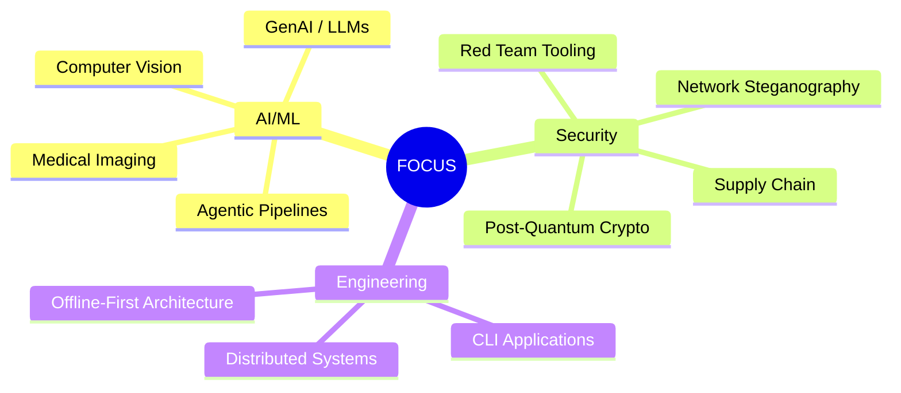

# Mehul Wagde

**AI/ML Engineer · Security Researcher · Open Source Builder**

---

## 🎯 Focus



---

## 🔗 Connect

[](https://github.com/YoinkingFishy)
[](mailto:wagdemehul@gmail.com)
[](https://linkedin.com/in/mehul-wagde)
[](https://instagram.com/your_handle)
[](https://discord.gg/your_server)
[](https://github.com/KnockDesk)

---

## ⭐ Featured

| Project | Stack | Highlights |
|---------|-------|------------|
| **[market-insight](https://github.com/YoinkingFishy/market-insight)** | `Python` `LLM` `Agents` | 4-agent research pipeline • Fully offline |
| **[deepfake-detection](https://github.com/YoinkingFishy/deepfake-detection)** | `Python` `OpenCV` `sklearn` | Signal-physics features • No GPU • 94%+ |
| **[synapse](https://github.com/YoinkingFishy/synapse)** | `Python` `Multi-LLM` | Router + local fallbacks • Zero-config |
| **[malware-analysis-platform](https://github.com/YoinkingFishy/malware-analysis-platform)** | `Python` `YARA` `PE` | 65 tests • Engine + parser + entropy |
| **[quantum-resistant-encryption](https://github.com/YoinkingFishy/quantum-resistant-encryption)** | `Python` `Crypto` | Toy LWE KEM + Winternitz/Merkle |
| **[self-hosted-shodan-clone](https://github.com/YoinkingFishy/self-hosted-shodan-clone)** | `Go` `SQLite` | Distributed scanner • REST API |

---

## 📊 Stats


---

## 🏗️ What I Build

```
71 repos  •  30 security tools  •  42 AI/ML projects  •  0 fluff
```

| Domain | Count | Example |
|--------|-------|---------|
| Agentic AI / LLM Apps | 11 | `multi-agentic-blog`, `doc-genius`, `synapse` |
| Computer Vision / Medical | 8 | `deepfake-detection`, `brain-tumor-detection` |
| Classification / Regression | 14 | `arrhythmia-detection`, `gold-price-prediction` |
| Security / Red Team | 30 | `exploit-development-framework`, `supply-chain-attack-simulator` |
| Infra / Distributed | 8 | `dns-sinkhole`, `distributed-password-cracker` |

**Every project:** `README` • `requirements`/`go.mod` • `pytest`/`go test` • `python -m` CLI • Offline-first

---

## 🛠️ Arsenal

**Languages**  


**ML/AI**  


**Security**  


**Frameworks & Tools**  


---

## 🤝 Open Source

- **traceloop/openllmetry** — `trace_content` param
- **saurabh-yergattikar/ShieldMCP** — Prompt injection patterns, benchmarks
- **Vero-protocol/vero-core-contracts** — `ZERO_ADDRESS_STR` fix
- **woshishadowhunter/oss-maintainer-copilot** — Issue categorization
- **santifer/career-ops** — FAQ expansion, npm docs
- **younisdev/dyvix-ui** — Typo fix
- **parth-thakre/ai-data-center-research** — Font loading

---

## 📈 Activity


---

> **Build small. Ship complete. Test everything. Document for the next person. Stay offline-first.**  
> **All 71 repos public.** Made for learning, auditing, extending.

---

<p align="center">
  
</p>
